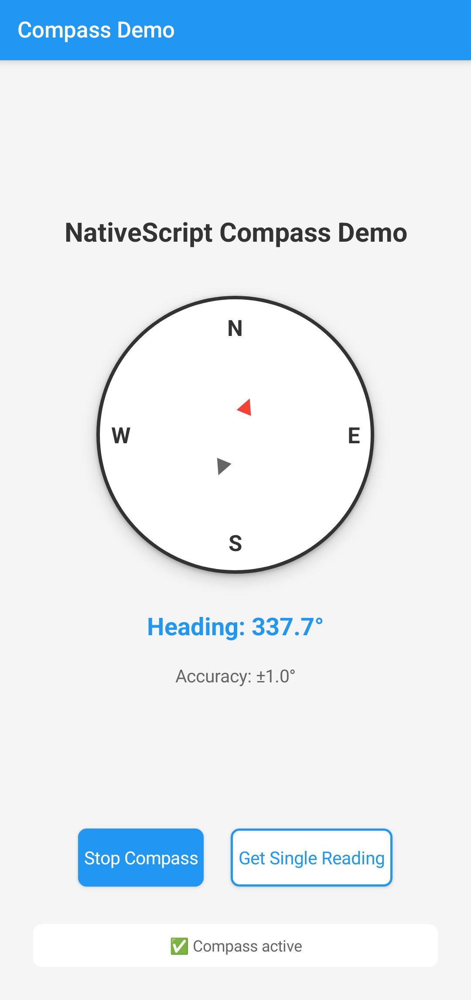

# NativeScript Compass Plugin

[](https://www.npmjs.com/package/nativescript-compass)
[](https://www.npmjs.com/package/nativescript-compass)

A NativeScript plugin that provides native compass functionality for both Android and iOS platforms. The plugin uses native sensor fusion algorithms and optimizes performance by minimizing JavaScript ↔ Native bridge calls.

## Features

- ✅ **Native Performance**: Sensor fusion and filtering implemented in native code
- ✅ **Cross-platform**: Unified API for both Android and iOS
- ✅ **Sensor Fusion**: Uses gyroscope + accelerometer/magnetometer on Android for improved accuracy
- ✅ **Configurable**: Customizable update intervals, filtering, and platform-specific options
- ✅ **TypeScript**: Full TypeScript definitions included
- ✅ **Optimized**: Minimal JavaScript bridge calls for smooth performance

## Installation

```bash
npm install nativescript-compass
```

## Permissions

### Android
The plugin automatically adds the required sensor features to your AndroidManifest.xml:

```xml
<uses-feature android:name="android.hardware.sensor.accelerometer" android:required="false" />
<uses-feature android:name="android.hardware.sensor.compass" android:required="false" />
<uses-feature android:name="android.hardware.sensor.gyroscope" android:required="false" />
```

### iOS
Add location permission to your Info.plist:

```xml
<key>NSLocationWhenInUseUsageDescription</key>
<string>This app uses compass for navigation and orientation features.</string>
```

## API Reference

### Import

```typescript
import { Compass } from 'nativescript-compass';
```

### Methods

#### `isAvailable(): boolean`
Check if compass functionality is available on the device.

```typescript
if (Compass.isAvailable()) {
    console.log('Compass is available');
}
```

#### `startUpdating(options, onReading, onError?): Promise<boolean>`
Start continuous compass updates.

```typescript
const success = await Compass.startUpdating(
    options,           // CompassOptions
    onReading,         // (reading: CompassReading) => void
    onError            // (error: string) => void (optional)
);
```

#### `stopUpdating(): boolean`
Stop compass updates.

```typescript
const stopped = Compass.stopUpdating();
```

#### `getCurrentReading(options?): Promise<CompassReading>`
Get a single compass reading.

```typescript
const reading = await Compass.getCurrentReading();
console.log(`Heading: ${reading.heading}°`);
```

### Interfaces

#### `CompassOptions`

```typescript
interface CompassOptions {
    // Minimum change in degrees to trigger callback (after filtering)
    minChangeThreshold?: number;      // default: 3

    // Minimum interval between callbacks in milliseconds
    updateThrottle?: number;          // default: 200

    // Smoothing filter coefficient: 0.0 = no filter, 1.0 = maximum smoothing
    // Note: Only used on Android. iOS uses hardware-level filtering
    filter?: number;                  // default: 0.8

    android?: {
        useSensorFusion?: boolean;    // Use gyroscope + accelerometer/magnetometer (default: true)
        sensorDelay?: 'fastest' | 'game' | 'ui' | 'normal'; // Sensor polling rate (default: 'ui')
    };

    ios?: {
        usesTrueHeading?: boolean;    // Use true north instead of magnetic (default: false)
        headingFilter?: number;       // minimum degrees change for hardware update (default: minChangeThreshold)
    };
}
```

#### `CompassReading`

```typescript
interface CompassReading {
    heading: number;                  // 0-360 degrees from north
    accuracy: number;                 // Accuracy in degrees (lower = better)
    timestamp: number;                // Reading timestamp

    // Optional fields (only if available)
    magneticHeading?: number;         // If different from heading
    trueHeading?: number;             // Only on iOS if usesTrueHeading=true
}
```

## Usage Examples

### Basic Usage

```typescript
import { Compass } from 'nativescript-compass';

export class CompassPage {
    async onLoaded() {
        if (!Compass.isAvailable()) {
            alert('Compass not available on this device');
            return;
        }

        await this.startCompass();
    }

    private async startCompass() {
        try {
            await Compass.startUpdating(
                {}, // Use default options
                (reading) => {
                    console.log(`Heading: ${reading.heading}°`);
                    this.updateCompassDisplay(reading.heading);
                },
                (error) => {
                    console.error('Compass error:', error);
                }
            );
        } catch (error) {
            alert('Failed to start compass: ' + error);
        }
    }

    onUnloaded() {
        Compass.stopUpdating();
    }
}
```

### Advanced Configuration

```typescript
const options = {
    minChangeThreshold: 1,    // High sensitivity - trigger on 1° change
    updateThrottle: 100,      // Update max every 100ms
    filter: 0.9,              // Strong smoothing
    android: {
        useSensorFusion: true,   // Use gyroscope for better accuracy
        sensorDelay: 'game'      // Higher polling rate for responsive app
    },
    ios: {
        usesTrueHeading: true,   // Use geographic north
        headingFilter: 0.5       // Hardware updates every 0.5°
    }
};

await Compass.startUpdating(options, onReading, onError);
```

### Single Reading

```typescript
try {
    const reading = await Compass.getCurrentReading();
    console.log(`Current heading: ${reading.heading}°`);
    console.log(`Accuracy: ${reading.accuracy}°`);
} catch (error) {
    console.error('Failed to get compass reading:', error);
}
```

### Performance Tuning

```typescript
// High-performance real-time app (navigation, AR)
const highPerformanceOptions = {
    minChangeThreshold: 0.5,
    updateThrottle: 50,      // 20 updates per second
    filter: 0.95,            // Strong smoothing
    android: {
        useSensorFusion: true,
        sensorDelay: 'fastest' // ~200Hz polling
    },
    ios: {
        headingFilter: 0.1       // Very sensitive
    }
};

// Standard compass app
const standardOptions = {
    minChangeThreshold: 3,
    updateThrottle: 200,
    filter: 0.8,
    android: {
        sensorDelay: 'ui'        // Default: good balance
    }
};

// Battery-saving indicator
const lowPowerOptions = {
    minChangeThreshold: 5,
    updateThrottle: 500,
    filter: 0.5,
    android: {
        useSensorFusion: false,
        sensorDelay: 'normal'     // ~5Hz polling
    }
};
```

## Screenshots

<details>
<summary>Android</summary>



</details>

<details>
<summary>iOS</summary>


</details>

## Platform Differences

### Android
- Uses **SensorManager** with accelerometer, magnetometer, and optionally gyroscope
- **Timer-based throttling**: Uses Timer to check data at regular intervals, combines with threshold checking
- **Sensor fusion** (`useSensorFusion: true`, default): Combines gyroscope + accelerometer/magnetometer for smoother, more accurate readings with less jitter
- **Simple mode** (`useSensorFusion: false`): Uses only accelerometer + magnetometer, faster but may be less stable
- **Sensor polling rates** (`sensorDelay`):
  - `'fastest'` (~200Hz): `SENSOR_DELAY_FASTEST` - High-precision apps, AR, gaming
  - `'game'` (~50Hz): `SENSOR_DELAY_GAME` - Interactive apps, responsive UI
  - `'ui'` (~16Hz): `SENSOR_DELAY_UI` - **Default** - good balance for most apps
  - `'normal'` (~5Hz): `SENSOR_DELAY_NORMAL` - Battery-conscious apps
- **Accuracy reporting**: Real sensor accuracy (1°-15°) from hardware status

### iOS
- Uses **CoreLocation** framework with **CLLocationManager**
- **True heading** available when `usesTrueHeading: true`
- **Heading filter** (`headingFilter`): Hardware-level filtering, default equals `minChangeThreshold`
- **Accuracy reporting**: Real accuracy from CoreLocation (varies by device and conditions)
- Requires location permission for compass functionality

## Performance Notes

- All filtering and throttling is performed in **native code**
- Minimal JavaScript bridge calls for optimal performance
- Configurable update rates to balance accuracy vs. battery life

## Troubleshooting

### Common Issues

1. **"Compass not available"**: Device lacks required sensors
2. **"Location permission denied"** (iOS): Add NSLocationWhenInUseUsageDescription to Info.plist
3. **Erratic readings**: Try increasing `filter` value or `minChangeThreshold`
4. **Battery drain**: Increase `updateThrottle` or disable `useSensorFusion`

### Best Practices

- Always check `isAvailable()` before starting compass
- Stop compass updates when not needed (`onUnloaded`, `onDestroy`)
- Use appropriate `updateThrottle` for your use case
- Test on real devices (simulators may not have sensors)

## Requirements

- NativeScript 8.0+
- iOS 11.0+
- Android API 21+

## License

Apache-2.0
